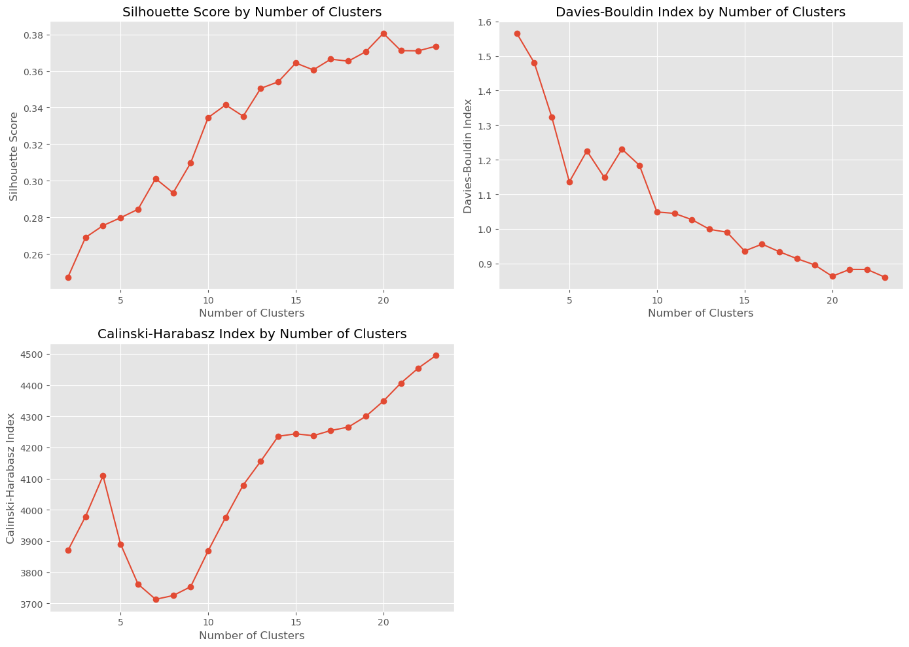

# DermNet Image Clustering with DINOv2 embeddings
Welcome to our image clustering project, where we leverage the power of DINOv2 embeddings and advanced clustering techniques to group similar images effectively. This project explores various steps, including feature extraction, dimensionality reduction, duplicates removal, and clustering optimization, to achieve meaningful and accurate image clusters.


## Table of Contents
1. [Introduction](#introduction)
2. [Dataset](#dataset)
3. [Setup](#setup)
4. [Project Structure](#project-structure)
5. [Methods](#methods)
   - [Feature Extraction](#feature-extraction)
   - [Duplicates Removal](#duplicates-removal)
   - [Dimensionality Reduction](#dimensionality-reduction)
   - [Optimal Number of UMAP Components](#optimal-number-of-umap-components)
6. [Results and Key Findings](#results-and-key-findings)
   - [Feature Extraction](#feature-extraction-1)
   - [Dimensionality Reduction](#dimensionality-reduction-1)
   - [Optimal UMAP Components](#optimal-umap-components)
   - [Cluster Analysis](#cluster-analysis)
7. [Final Model](#final-model)

## Introduction
Welcome to our image clustering project, where we leverage the power of DINOv2 embeddings and advanced clustering techniques to group similar images effectively. This project explores various steps, including feature extraction, dimensionality reduction, duplicates removal, and clustering optimization, to achieve meaningful and accurate image clusters.

## Dataset
We performed clustering on the train part of the DermNet dataset available on [Kaggle](https://www.kaggle.com/datasets/shubhamgoel27/dermnet).

## Setup
To get started, clone the repository and install the necessary dependencies:
```bash
git clone https://github.com/IgorKolodziej/DERMNET.git
cd DERMNET
pip install -r requirements.txt
```

## Project Structure
- `01_EDA.ipynb`: Exploratory Data Analysis of the dataset.
- '02_dermnet_clustering.ipynb': Complete pipeline for image clustering.
- 'dermnet.pdf': Presentation slides.
- `embeddings_dino_base.npy`: DINOv2 embeddings for the dataset without duplicates.
- 'embeddings_dino_base_with_duplicates.npy': DINOv2 embeddings for the dataset with duplicates.
- 'cluster_labels.csv': Cluster labels for the train part of the dataset.

## Methods
### Feature Extraction
We utilize the DINOv2 model for image feature extraction due to its superior performance in generating rich and discriminative embeddings, essential for effective clustering.

### Duplicates Removal
Before extracting embeddings, we remove duplicate images using a SHA-256 hashing technique to ensure a unique and diverse dataset.

### Dimensionality Reduction
We experiment with PCA and UMAP to reduce the dimensionality of DINOv2 embeddings. UMAP was found to significantly outperform PCA, providing a more meaningful representation of the data's intrinsic structure.

### Optimal Number of UMAP Components
To determine the optimal number of UMAP components, we test various n_components values with KMeans and OPTICS algorithms, evaluating the results using clustering metrics such as the Silhouette score, Calinski-Harabasz index, and Davies-Bouldin index.

## Results and Key Findings
The final clustering results demonstrate the effectiveness of our approach, 
leveraging DINOv2 embeddings and Agglomerative Clustering to produce meaningful and well-defined image clusters.

### Feature Extraction
DINOv2 embeddings provided high-quality features essential for effective clustering. We experimented with ResNet50 for feature extraction, but it was significantly outperformed by DINOv2.

### Dimensionality Reduction 
UMAP outperformed PCA, preserving the intrinsic geometry of the data better. 

### Optimal UMAP Components
Experimentation showed that tuning the number of UMAP projection components significantly improved clustering performance.

### Cluster Analysis
The clusters were mostly divided by body parts, demonstrating the effectiveness of our approach in capturing relevant visual patterns.
Additionally, we managed to isolate contaminated clusters of images that should not belong to the dataset. 


An example of a contaminated cluster. Does anyone know what that is??"

## Final Model
Despite KMeans showing slightly better metrics, we choose Agglomerative Clustering for the final model due to its robustness, flexibility, and ability to handle clusters of arbitrary shapes, providing a hierarchical clustering tree for better insight into the data structure.




